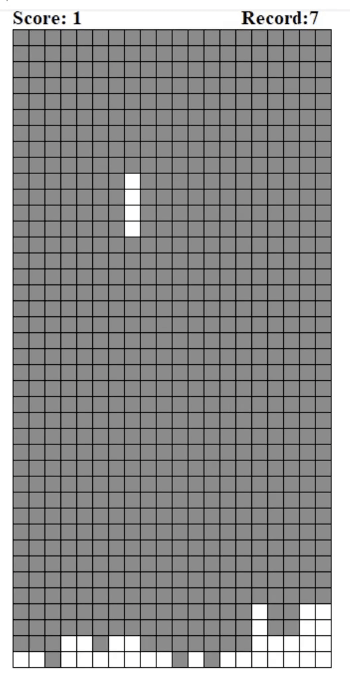

# Tetris

 Animated desktop Tetris game using tkinter.
 
 <p1 align="center">
  

    
  

</p1>

 Score.txt is a file that saves your highest record in game.

## How to play
  Run `python3 Tetris.py` to play. 
  
  ### Keyboard Input:
  Up:  Turn the tetris piece clockwise
  
  Down: Turn the tetris piece counterclockwise
  
  Left: Move the tetris piece to the left
  
  Right: Move the tetris piece to the right
 
## Requirements:
  tkinter.py
  
Enjoy!
